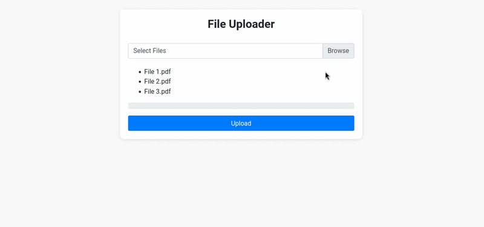

# File Uploader and Downloader Website

This is a simple web application featuring both a file uploader and a file downloader, designed to simplify file management and sharing tasks with its intuitive interface and responsive design.

## Features

- File Uploader:
  - Select and upload multiple files to the server.
  - Monitor upload progress with a visual progress bar.
  - Responsive design for seamless usage across devices.

- File Downloader:
  - List files stored in a specified directory.
  - Generate download links for each file.
  - Login feature that enable the deletion option.

## Technologies Used

- HTML
- CSS (Bootstrap)
- JavaScript (jQuery)
- PHP (for server-side functionality)
- SQL (using PHP-MyAdmin)

## Demo GIF

  

## License

This project is licensed under the [MIT License](LICENSE).

## Contact

If you have any questions or feedback, feel free to contact me at [adham-95@windowslive.com](mailto:adham-95@windowslive.com).
